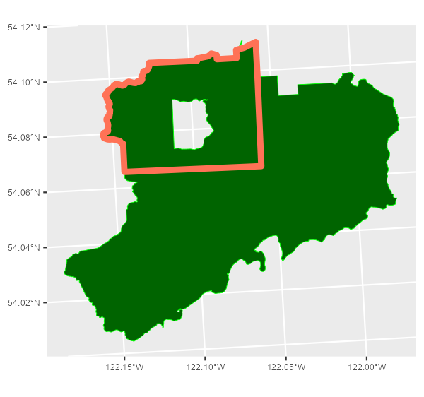

```{r, include = FALSE}
## NOTE to regenerate all of the results of this Rmd 
## some chunks will need to be run manually prior to 
## knitting the report
## i.e. ones that generate graphics.


knitr::opts_chunk$set(
  collapse = TRUE,
  comment = "#>"
)
```

```{r setup, message=FALSE, warning=FALSE}
library(PEMprepr)
library(ggplot2)
library(sf)
library(terra)
```

`PEMprepr`, short for _Predictive Ecosystem Mapping -- Preparation_ is the first of a
series of packages supporting the British Columbia Biogeoecosystem Classification's  
Predictive Ecosystem Mapping (PEM) project.  See [BC-BEC](https://www.for.gov.bc.ca/HRE/becweb/index.html) 
and [`PEMr`](https://github.com/bcgov/PEMr) on _GitHub_for details about the BC BEC classification system and, 
the PEM Project. 

A portion of the  [Aleza Lake Research Forest](aleza.unbc.ca), one of the pilot study sites for this project, 
is used for this example. The area outlined in red will be used in the steps below

```{r, echo = FALSE, eval = FALSE, include=FALSE}
## this section is invisible ... just used to create the image.
aleza <- sf::st_read(system.file("extdata/aleza.gpkg", 
                                 package = "PEMprepr"), 
                     quiet = TRUE)
                     
aoi   <- sf::st_read(system.file("extdata/aleza_nw.gpkg", 
                                 package = "PEMprepr"), 
                     quiet = TRUE)

g <- ggplot() + geom_sf() +
  geom_sf(data = aleza, colour = "green", fill = "darkgreen") + 
  geom_sf(data = aoi, colour = "red", lwd = 1.5, fill = NA) + 
  labs(title = "Aleza Lake Research Forest") +
  theme(axis.text = element_text(size = 6))

ggsave(plot = g, "./vignettes/aleza.png", dpi = 150,
       width = 4, height = 3.75)

```

```{r, echo = FALSE, fig.align='center', fig.cap="The Aleza Lake Research forest with the area of interest outlined in red"}


```


In the example below it is assumed that you are running the following within a new R project. 

# Workflow

The following provides a standard workflow for preparing data for subsequent 
sampling, modeling, and mapping.  The key steps demonstrated below include: 

1. Data folder set up. 
2. Alignment of the area of interest 
3. Generation of covariates 
4. Creation of a multi-resolution raster stack
4. Collection of vector data. 


# Folder setup

Data for the project can quickly become difficult to manage.  To facilitate ease of data management 
a standard set of folders for each area of interest. The following creates the needed folders for 
the area of interest: _aleza_. In addition, `fstr` stores a named list of the folders created 
which we will utilize later (e.g. to programmatically place results of functions in the correct place).
_Note: if the folders have been generated previously this function will still return the list of 
folder names. 


```{r, results='hold'}
# creates dirs and returns a named list
fstr <- setup_folders("aleza",            
                      full_names = FALSE) # relative or full path

str(fstr[1:5]) ## first 5 in the list. 
```

# Alignment of the area of interest


Load the spatial data
```{r}
aoi   <- sf::st_read(system.file("extdata/aleza_nw.gpkg", 
                                 package = "PEMprepr"), quiet = TRUE)

sf::st_bbox(aoi) ## note extent
```

One concern, with this _area-of-interest_ (`aoi`) (red area) is that the bounding box 
or geographic extent of the area ends with very random numbers (output above).  Using this extent 
will cause significant problems later when we attempt to stack numerous rasters.  


## Snap the extent 

Here the `aoi` is snapped to an extent divisible by 100.  This will facilitate the generation of rasters data that all fits this grid extent and thereby can be stacked with relative ease. 

```{r}
aoi <- aoi_snap(aoi, method = "shrink") ## or expand
```


## Raster templates 

The snapped `aoi` can now be used to create a raster template.  In the example below a 25m^2^ raster template is created.  

```{r}
t25 <- create_template(aoi, 25)
t25 ## note that the extent of the raster is the same as the aoi. 
```

# Generation of covariates 

Here we generate the terrain derived covariates.  This is powered by [SAGA-GIS](https://saga-gis.sourceforge.io/en/index.html).  Covariates are generated at multiple resolutions, for example 5, 10, and 25m^2^.  

Steps to create the covariates 

1. load a digital terrain model (`dtm`).  Generally, this will be a high resolution model derived from lidar. 
2. align the `dtm` to the template.  resample the `dtm` to the desired resolution -- here we demonstrate using the 25m^2^ templated created above. 
3. create the covariates

## Import the terrain model

```{r}
dtm <- terra::rast(system.file("extdata/aleza_nw.tif",
                               package = "PEMprepr"))
dtm
```

```{r, eval=FALSE, include=FALSE}
## Invisible -- use this manually to create the graphic
library(tidyterra) ## ggplot with rasters 

g <- ggplot() + 
  geom_spatraster(data = dtm) +
  scale_fill_whitebox_c(palette = "high_relief") +
  geom_sf(data = aoi, colour = "red", lwd = 1.5, fill = NA) + 
  labs(title = "Aleza Lake RF",
       subtitle = "North-west corner",
       fill = "Elevation") + 
  theme(axis.text = element_text(size = 6))

ggsave("./vignettes/aleza_aoi_dtm.png", dpi = 150, 
       height = 4, width = 5.2)
```

```{r dtm-and-aoi, echo=FALSE, fig.cap="A raw digital terrain model with the area-of-interest noted in red. All processed rasters will align with the aoi."}

knitr::include_graphics("./aleza_aoi_dtm.png")
```


## Align the raster 

```{r}
dtm25 <- align_raster(dtm, t25)
dtm25
```

## Create the covariates

```{r, eval=FALSE}
layer_options <- 
  c("Filled_sinks", "sinkroute", "dem_preproc", 
    "slope_aspect_curve", "tCatchment", "tca", "sCatchment", 
    "twi", "channelsNetwork", "Distance2Water", 
    "MultiResFlatness", "MultiResFlatness2",
    "MultiResFlatness3", "TRI", "convergence", "Openness",
    "dah", "TPI", "RidgeValley", "MRN", "FlowAccumulation",
       "SlopeLength", "FlowAccumulation2", "FlowAccumulation3",
                 "FlowPathLength", "FlowPathLength2", "FlowPathLength3", 
                 "LSFactor", "SolarRad", "Convexity", "VertDistance", "TCI_low",
                 "SWI", "WindExp", "Texture", "Protection", "VRM",
                 "MBI", "mscale_TPI", "RelPosition", "SlopeCurvatures",
                 "SteepestSlope", "UpslopeArea")


create_covariates(dtm = dtm25,           ## raster created above
                  SAGApath = "c:/SAGA/", ## Where SAGA GIS is installed
                  output = fstr$cov_dir, ## from the setup_folders above
                  layers = "UpslopeArea")        ## 

```

Note that the pre-defined output directory `fstr$cov_dir`, created using `setup_folders()`, is used to ensure generated covariates are saved to the correct location. Rasters are also saved into subfolders of the same resolution.


```{r, eval=FALSE}
l <- list.files(path = fstr$cov_dir, pattern = ".sdat",
                recursive = TRUE)
l <- l[!grepl("xml",l)]

## created covariates 
head(l, 20)

#>  [1] "25/aspect.sdat"              
#>  [2] "25/cnetwork.sdat"            
#>  [3] "25/convergence.sdat"         
#>  [4] "25/convexity.sdat"           
#>  [5] "25/dah.sdat"                 
#>  [6] "25/dem_preproc.sdat"         
#>  [7] "25/diffinso.sdat"            
#>  [8] "25/direinso.sdat"            
#>  [9] "25/down_curv.sdat"           
#> [10] "25/dtm.sdat"                 
#> [11] "25/Filled_sinks.sdat"        
#> [12] "25/flow_accum_ft.sdat"       
#> [13] "25/flow_accum_p.sdat"        
#> [14] "25/flow_accum_td.sdat"       
#> [15] "25/flowlength1.sdat"         
#> [16] "25/FlowPathLenTD.sdat"       
#> [17] "25/gencurve.sdat"            
#> [18] "25/hdistnob.sdat"            
#> [19] "25/local_curv.sdat"          
#> [20] "25/local_downslope_curv.sdat"
```


<center>
_Note: As SAGA-GIS is used the files resulting files are all saved in `.sdat` format -- this is read/writable by `terra::rast`_
</center>


# Creation of the multi-resolution raster stack

Generation of the covariates above is repeated for each resolution in the multi-resolution model.  In order to make all of the rasters stackable, necessary for model and map generation, they must all have the same extent and resolution.  

The process above ensures they all have the same extent.  

Next the coarse resolution rasters are _disaggregated_ to a fine scale resolution.  This means that the data in the resulting raster is the data of the coarse-raster but in a fine scale format. 

<center>
_Note: it is highly recommended to use `full.names = TRUE` to list the files._
</center>

```{r, eval=FALSE}
## we can use the list of files from above
l <- list.files(path = fstr$cov_dir,
                pattern = ".sdat",
                full.names = TRUE, ## Use TRUE
                recursive = TRUE)
l <- l[!grepl("xml",l)]


create_fine_res(inputFileList = l[1:5],     ## using the list of files above  
                output = fstr$cov_dir, ## from setup_folders())
                targetRes = 5)

#> [1] "Processing: aleza/10_clean_inputs/covariates/25/aspect.sdat"
#> [1] "Created: aleza/10_clean_inputs/covariates/5/aspect_25.sdat"
#> [1] "Processing: aleza/10_clean_inputs/covariates/25/cnetwork.sdat"
#> [1] "Created: aleza/10_clean_inputs/covariates/5/cnetwork_25.sdat"
#> [1] "Processing: aleza/10_clean_inputs/covariates/25/convergence.sdat"
#> [1] "Created: aleza/10_clean_inputs/covariates/5/convergence_25.sdat"
#> ...
```

This script is a wrapper for `terra::disaggregate`.


# Collection of vector data

A standard set of Vector data is used for subsequent sample planning and is based on the `aoi`.  This script collects numerous vector layers from the [BC Data Catalogue](https://catalogue.data.gov.bc.ca) making use of the [`bcdata`](https://github.com/bcgov/bcdata) package


```{r, eval=FALSE}
create_base_vectors(in_aoi = aoi,
                    out_path = fstr$shape_raw_dir)
```

files are saved in _geopackage_ format. 
